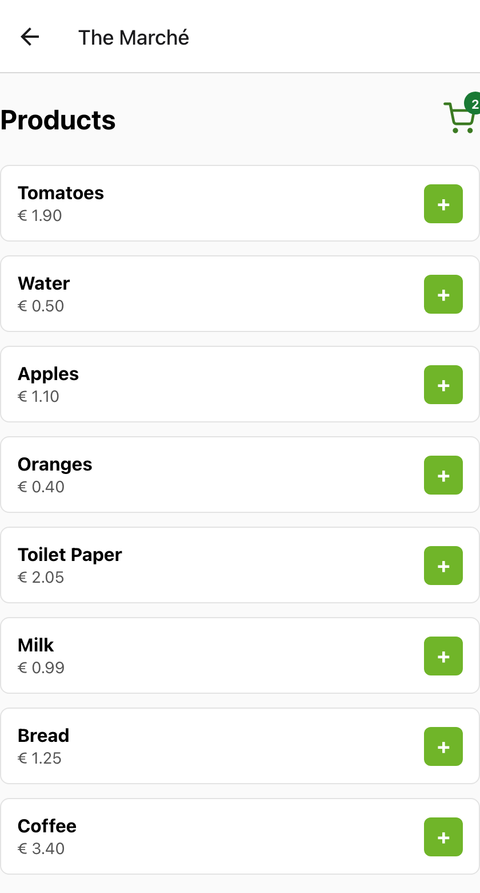

# The Marché — Shopping Cart App

[](https://themarcheapp.netlify.app)


A small **mobile shopping-cart app** built with **React Native (Expo)**. Browse a
product list, add items to the cart, adjust quantities, and see the running total —
with cart state shared across screens via React Context.

**🔗 Live demo:** https://themarcheapp.netlify.app *(web build of the React Native app, via react-native-web)*



## Features

- Product catalog with **search** and **category filters** (Produce, Drinks, Bakery, Household)
- **Add to cart** with per-item **+ / − quantity** controls and a **live total**
- **Checkout** flow: order summary → confirmation ("Order placed!")
- **Cart persistence** across reloads via AsyncStorage
- Cart **badge** with the item count; product icons for a store-like feel
- Shared cart state via **React Context** (single source of truth)
- Screens: Login → Shop → Cart → Checkout (React Navigation stack)
- **Unit-tested** cart logic (Jest) — pure functions kept separate from the UI

## Tech

React Native · Expo (SDK 48) · React Navigation · React Context · react-native-web

## Run it

**On your phone (Expo Go):**

```bash
npm install
npx expo start        # scan the QR code with the Expo Go app
```

**In the browser (web build):**

```bash
npm install
npx expo start --web
```

**Run the tests:**

```bash
npm test        # Jest — unit tests for the cart logic (src/lib/cart.js)
```

## Notes

- The login screen is a **demo entry point** — it doesn't perform real authentication.
- The product catalog is static/in-memory (no backend).
